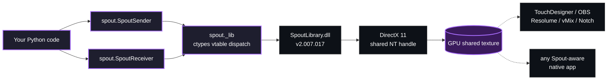

<p align="center">
  
</p>

<p align="center">
  
  
  
  
</p>

# spout2-python

Python bindings for [Spout2](https://spout.zeal.co/) — real-time GPU texture sharing on Windows.
Lets Python send and receive video frames to/from any Spout-aware application (TouchDesigner, OBS, Resolume, game engines, etc.).

**Windows x64 only.** Requires DirectX 11.

## How it works



The whole stack is Python + ctypes against a single DLL — no compilation,
no SDK download. Ship is `pip install` only.

> **Built on top of [Spout2](https://github.com/leadedge/Spout2) by Lynn Jarvis.**
> All the heavy lifting — the DirectX/OpenGL interop, the shared-texture
> protocol, the `SpoutLibrary.dll` itself — is his work. This package is
> just a thin Python layer on top. Huge thanks to Lynn and the Spout
> community for keeping the project alive and open. ❤️

## Install

```bash
pip install .
```

With PyTorch/NumPy support for the tensor examples:

```bash
pip install ".[torch]"
```

Or directly from GitHub (no git clone needed):

```bash
pip install git+https://github.com/UnveilStudio/spout2-python.git
```

## Quick start

```python
from spout import SpoutSender, SpoutReceiver, GL_RGBA

# Send frames
with SpoutSender("MySender") as sender:
    sender.send_image(rgba_bytes, width, height)

# Receive frames
with SpoutReceiver("MySender") as receiver:
    while True:
        if receiver.receive():
            buf = bytearray(receiver.sender_width * receiver.sender_height * 4)
            receiver.receive_image(buf, receiver.sender_width, receiver.sender_height)
```

## Examples

| File | What it shows |
|---|---|
| `examples/send_example.py` | Animated gradient sender (NumPy vectorised, 1280×720 @60fps) |
| `examples/receive_example.py` | Connect to any active sender |
| `examples/preview_example.py` | cv2 window receiver — see the sender live |
| `examples/share_image.py` | Send an image (defaults to the bundled `assets/unveil_logo.png`) |
| `examples/tensor_send.py` | Send a PyTorch tensor `(C, H, W)` float [0,1] |
| `examples/tensor_receive.py` | Receive frames as tensors, zero-copy |
| `examples/inference_loop.py` | Full Spout → model → Spout round-trip (StreamDiffusion-ready) |
| `examples/demo.bat` | Double-click to launch the sender publishing the bundled Unveil logo |
| `examples/preview_local.py` | **End-to-end Python demo**: sender + cv2 preview window in one script |

```bash
python examples/send_example.py
python examples/receive_example.py
```

### One-click full-Python demo

Double-click **`examples/preview_local.bat`** (or run
`python examples/preview_local.py`).

You'll get an animated cv2 window showing the bundled Unveil logo with a
scrolling cyan band — the frames come straight from a Spout sender
running in the same script, so any external Spout receiver
(TouchDesigner, OBS, Resolume, vMix, Notch, …) on the same machine will
see the source `PythonPreview_<pid>` simultaneously.

Press `q` in the preview window to stop everything.

### Sender-only one-click demo

Double-click **`examples/demo.bat`** to publish the Unveil logo as a
Spout source called `PythonImage` at 30 fps without opening a Python
preview. Open **TouchDesigner** with a "Spout In" TOP set to
`PythonImage`, or **OBS** with a "Spout2 Capture" source — they pick up
the logo within a second.

## Tensor / inference usage

```python
import ctypes
import numpy as np
import torch
from spout import SpoutSender, SpoutReceiver, GL_RGBA

# --- Send a tensor (zero-copy) ---
# tensor: float32 (3, H, W) in [0, 1]
chw = tensor.detach().cpu().clamp(0, 1)
hwc = chw.permute(1, 2, 0).numpy()
h, w = hwc.shape[:2]
rgba = np.empty((h, w, 4), dtype=np.uint8)
rgba[..., :3] = (hwc * 255).astype(np.uint8)
rgba[...,  3] = 255
buf = (ctypes.c_ubyte * rgba.size).from_buffer(np.ascontiguousarray(rgba))
sender.send_image(buf, w, h, GL_RGBA)

# --- Receive into a tensor (zero-copy) ---
arr = np.empty(h * w * 4, dtype=np.uint8)
recv_buf = (ctypes.c_ubyte * arr.size).from_buffer(arr)
receiver.receive_image(recv_buf, w, h, GL_RGBA)
tensor = torch.from_numpy(arr.reshape(h, w, 4))          # uint8 HWC, no copy
model_input = tensor[..., :3].permute(2, 0, 1).float() / 255  # float CHW
```

See `examples/inference_loop.py` for the full receive → inference → send loop with StreamDiffusion integration notes.

## Spout2 SDK version

Bindings target **SpoutLibrary.dll v2.007.017** (bundled). Vtable indices are mapped from `SpoutLibrary.h` declaration order. See `spout/_lib.py` for details.

## Support this project

If `spout2-python` saves you time or makes its way into something cool, you can
throw a beer 🍺 at the maintainer:

- 🟧 **Patreon** — [patreon.com/unveil_studio](https://www.patreon.com/unveil_studio)
- 💸 **PayPal** — [paypal.me/Unveilstudio](https://paypal.me/Unveilstudio)

Every tip is genuinely appreciated and goes straight into keeping this and
similar tools alive.

## License

This project is released under the **MIT License** — see [`LICENSE`](LICENSE).

The bundled `spout/SpoutLibrary.dll` is © 2020-2024 Lynn Jarvis and is
distributed under the **BSD 2-Clause License** as part of the
[Spout2](https://github.com/leadedge/Spout2) project. The full notice is
reproduced in [`THIRD_PARTY_LICENSES.md`](THIRD_PARTY_LICENSES.md).
